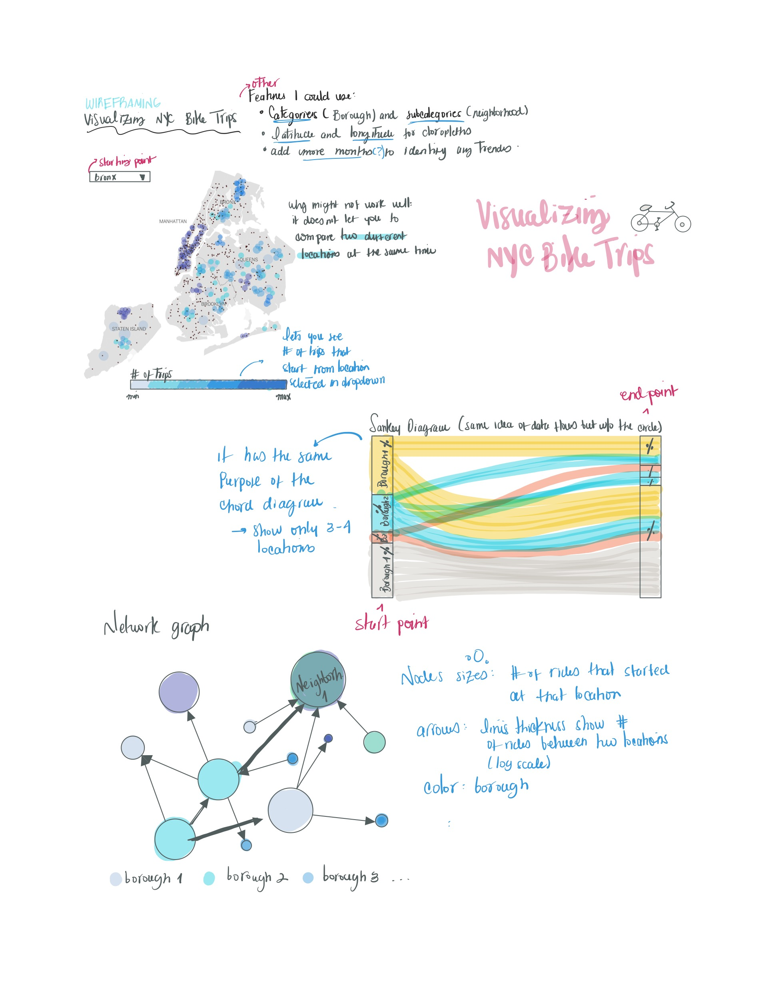

# Critique by Design: Visualizing NYC Bike Trips
2/3/2022

## The data and original visualization
The [Citi Bike System data](https://ride.citibikenyc.com/system-data) has information about bike rides in NYC. It allows to answer questions like: where do bikers ride? When do they ride? And how far do they go?. The dataset I'll be working with contains the following columns (for both start and end points):

* `station id` (string)
* `borough` (string)
* `zipcode` (string)
* `neighborhood` (string)
* `latitude` (float)
* `longitude` (float)

We could also have `tripduration`, `starttime` and `stoptime`, but for, now we'll ignore those to simplify.

In a [Medium post](https://medium.com/towards-data-science/visualizing-nyc-bike-share-trips-with-a-chord-diagram-eb4c8e14366), the author used **September 2020's records** to show how a *chord diagram* —which provides a way to visualize flows between entities— could be used to represent the Citi Bike data; particularly, the author was interested in showing bike commutes frequencies between two stations (regardless of time). 

The final visualization looked like this:

**Note**: This wasn't intended for the general audience but was designed as a Python tutorial. That's why you don't see any labeling. It's worth noting that these visualizations are more useful when you incorporate interactive capabilities to explore further the data (which the author mentions and demonstrates by focusing on one borough).

Sure, chord diagrams are very eye-catching, but more often than not, audiences will find themselves confused about the main takeaway of the visualization. Additionally, depending on the number of categories displayed and whether you'd expect them to have a natural order, it's hard for the naked eye to identify at a glance meaningful differences between flows. Consider for a moment the visualization above and ask: *what can I conclude from this visualization?* You'll find yourself turning your head a couple of times to read the labels and following those long lines that connect with each other. In the end, you're just too distracted by all the colors and unusual shapes that it'll be too hard to have an aha moment (not to mention that it can be exhausting decoding all these data without additional visual aids).

## Wireframes
I focused on different ways to represent data flows without all the messiness from the original visualization. Here are a few things that I kept in mind as I was working on my sketches:
* Add different levels of abstraction to the data to be able to do aggregations and decrease the number of categories.
* Provide a way to show fewer categories for easier comparison across neighborhoods/boroughs.
* Take advantage of additional features not used by the original data viz (such as geolocation).
* As the data is enormous (more than 2 million records at the individual level), provide interactivity to let the user further explore the data.

## Testing the solution
I interviewed two friends, and both feel comfortable reading visualizations and extracting insights from them. So I figured they would help them quickly identify elements that introduced noise and confusion. To start with, it was clear what the visualization was about for both of them; either an analysis of where bike trips happen more frequently or an analysis of the most frequent routes for bikers (where they start and where they end). So that was promising. Additionally, the intent of the different sketches was also apparent, even if the data displayed in the drawings was not accurate. Person 1 said: *"Bikes are more intensively used in specific NY boroughs,"* and person two said: *"The most common starting for bike trips in NYC."* The latter was very positive because it seemed that, at a glance, the data visualizations chosen conveyed the main point straight and clearly; something I felt the original data viz failed to do so.
In terms of the audiences, they replied it could be for either a transit authority or a biker thinking of moving to NYC. This was very interesting because they said the could imagine someone using an app to check for this busy routes on a daily basis. That helped me to see the importance of having an interactive feature to be able to filter/select via a dropdown different starting points. Finally, I asked:

**Is there anything you find surprising or confusing?**
* Person 1: *I find the heatmap really confusing: how can a dot represent a bike trip? If that’s the starting point, it’s missing vital information such as where the trip is going* - From this answer, I realized that my sketches might have been a bit clearer as the dot in the map was showing the end point and via the dropdown, the user could see the staring point. 
* Person 2: *at first glance, the “sankey diagram” looks confusing but after a couple of seconds, the insights are intuitive. However, I feel it might difficult to show more than 2-3 boroughs/neighborhoods at the same time.* - I also thought about this, and I agree that the main pitfall from this data is how it constrains the number of boroughs/neighborhoods you could add. However, adding a dropdown feature might also help (as with the heatmap). Yet, I'm not sure I feel good about having to spend more than a couple of seconds to extract the insight.

**Is there anything you would change or do differently?**
* Person 1: *I wouldn’t use the heatmap at all. At first, I thought it showed the population of bikers which was wrong. In general, I think it doesn’t help to convey the intensity of bike commutes.*
* Person 2: *In the network graph, the edges are directional, which suggests commutes in a specific direction. I’d add a separate line for each.*

From the answers above, I thought that maybe the best way to represent the data would be using the Sankey diagram. As mentioned at the beginning of this document, this chart type can be helpful when there are only a few categories. Additionally, eliminating the "fun shapes" might improve readability, unlike the chord diagram. Yet, during today's class exercise (2/7/22), my classmates said they disagreed with person 1 and that a heatmap might be the best way to represent this data. They also suggested that having two maps next to each other may help overcome the "lack of comparability" that the map had.

## Solution

For my final visualization, I tried to find the middle ground between a Sankey diagram, showing data flow between two points, and a map showing the exact location of such points. I felt that each visualization had its pros and cons, and with the Arc Map, I was able to have the best of both worlds. I ulse tried to include a descriptive title conveying an insight for the general public and different labels and notes to help understand the visualization. Finally, this data viz also allowed me to remove all the colors since having the locations makes the color-coding unnecessary. 

> When I showed this dataviz to the interviewee that said the map felt unintuitive, his eyes widened in amazement, and he said that was exactly what he was talking about. 

[Go back to main page](/README.md)
