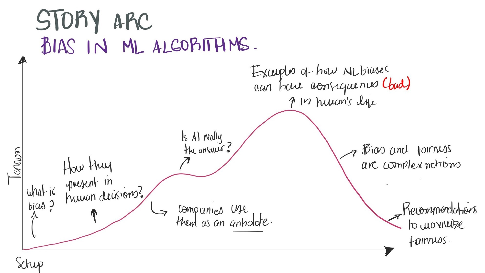

# Final Project: Bias in AI and ML Algorithms
## Part I
Sunday, February 13, 2022

### 1. Outline
**Summary**: ML algorithms have proven to bake in and scale up human and societal biases, failing to provide services to people equally and transparently.

**Reader objective:** As a reader, I want to understand how we introduce biases in ML algorithms so that I can apply techniques and good practices to avoid them.

**Story Arc:**
* Set**up**: Companies have used ML algorithms as a refreshing antidote to overcome the objective interpretation of data in human decisions.
* **Conflict**: these algorithms are exacerbating human and societal biases, and in some cases, they can have terrible consequences for the people they're supposed to serve. 
* **Resolution**: the ML community is creating standards and open-source toolkits to prevent these biases.

The project structure would like like the following: 

As you can see, I've highlighted the sections I'd like to go over during my presentation:

1. What is bias in its broadest terms? [Setup]
2. How are biases present in human-based decisions, and why can ML help us overcome those biases?
3. Companies use AI and ML algorithms as a refreshing antidote to overcome human-based decision biases, but they can bake in and scale up human and societal biases if misapplied.
4. Is AI really the answer? go through some examples of how algorithms are making detrimental decisions against protected demographies
5. ML biases can have dire consequences in a human's life [peak of the conflict, where I present a case study]
6. Biases and fairness are complex notions: why is it so hard to prevent and sometimes, even identify.
7. Recommendations of experts to maximize fairness in ML implementations [resolution] 

### 2. The Data

For the project, initially, I'll use four datasets. Here I list the sources with the links. For the next milestone, I'll incorporate the data attributes (columns, datatypes, timeframe, etc.). I'll use these datasets to exemplify how ML algorithms can have detrimental effects and consequences for the populations they're built to serve. I plan to create one visualization for each dataset that conveys how the underlying algorithm scaled-up societal biases, going from minor to deadly consequences. 

| Name | Description | Link | Citation |
|:-----|:------------|:-----|:---------|
| Gender-based discrimination in job-related ads | The dataset contains hundreds of fresh browser instances (ids) along with the Ads seen by "male" and "female" browsers. It was used to test the likelihood of a high-paying job Ad being shown to women vs. men | [Publications section](https://www.cs.cmu.edu/~mtschant/ife/) | Michael Carl Tschantz et al., “A Methodology for Information Flow Experiments,” in 2015 IEEE 28th Computer Security Foundations Symposium (2015 IEEE 28th Computer Security Foundations Symposium (CSF), Verona: IEEE, 2015), 554–68, https://doi.org/10.1109/CSF.2015.40. |
| Assessing Gender Bias in Machine Translation | The dataset contains comprehensive list of job positions from the U.S. Bureau of Labor Statistics (BLS) and used it to build sentences in constructions like "He/She is an Engineer" in 12 different gender neutral languages such as Hungarian, Chinese, Yoruba, and several others. It also provides translations of these sentences into English using the Google Translate API, along with statistics about the frequency of female, male and gender-neutral pronouns in the translated output. | [GitHub Repo](https://github.com/marceloprates/Gender-Bias) | Marcelo O. R. Prates, Pedro H. C. Avelar, and Luis Lamb, “Assessing Gender Bias in Machine Translation -- A Case Study with Google Translate” ArXiv:1809.02208 [Cs], March 11, 2019, http://arxiv.org/abs/1809.02208.| 
| Gender and Jobs in Online Image Searches | The data contains the proportion of women who work in each occupation, using 2017 [Bureau of Labor Statistics data](https://www.bls.gov/cps/cpsaat11.htm). Additionally, it contains the percent of individuals estimated to be women, across 100 Google image search results for each occupation | [Pew Research](https://www.pewresearch.org/social-trends/2018/12/17/gender-and-jobs-in-online-image-searches/) |  “How Men and Women Appear in Online Job Image Searches,” Pew Research Center’s Social & Demographic Trends Project (blog), December 17, 2018. |
| Dissecting racial bias in an algorithm used to manage the health of populations | Commercial prediction algorithms to identify and help complex health needs divided broken down by race. | [GitLab Repo](https://gitlab.com/labsysmed/dissecting-bias) | Ziad Obermeyer et al., “Dissecting Racial Bias in an Algorithm Used to Manage the Health of Populations,” 2019, 8. https://www.science.org/doi/10.1126/science.aax2342 |

### 3. Sketches

The sketches below show how I'll represent the datasets described above. Please consider that until I have a look at the data, I won't know what is the message they're conveying. These sketches belong mainly to sections 4 and 5 of the outline above.

### 4. Method and Medium
The project will be implemented using [Shorthand](https://shorthand.com) to create an immersive narrative and either Tableau or Flourish for visualizations (and incorporate interactivity when applicable). After exploring the options offered by Shorthand, I think it will help me to elevate my story and introduce the tensions I'd like to, based on the readings from Chapter 8 of Good Charts. There's really not much I can say at this point.
